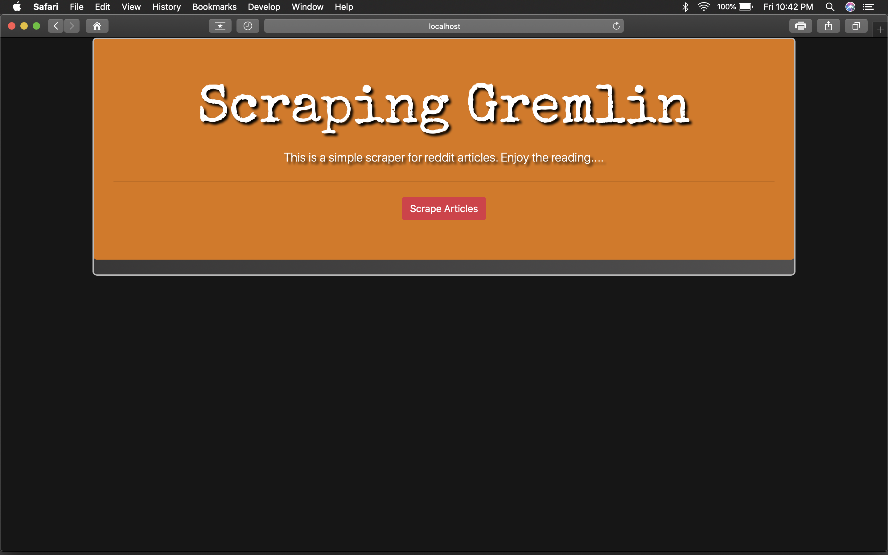
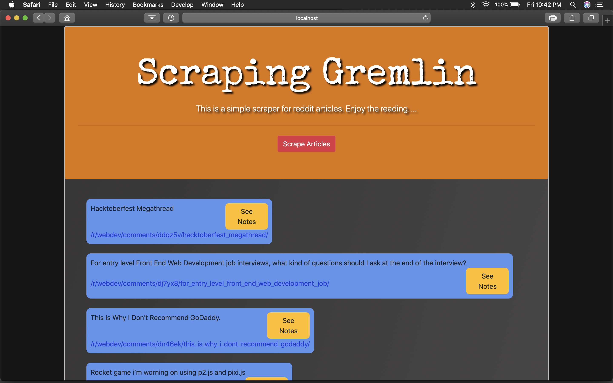
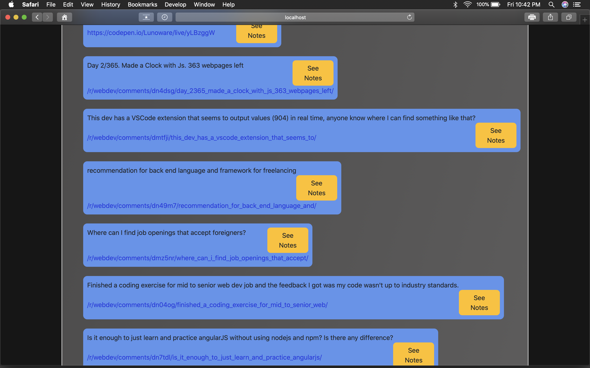
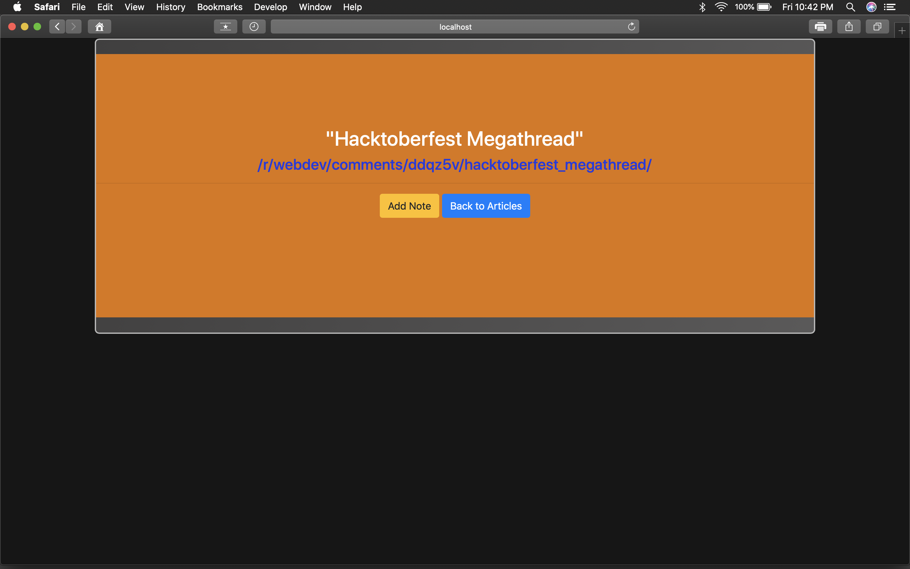
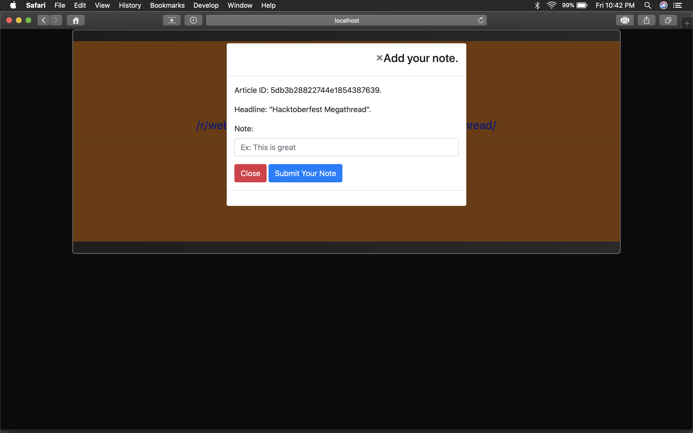
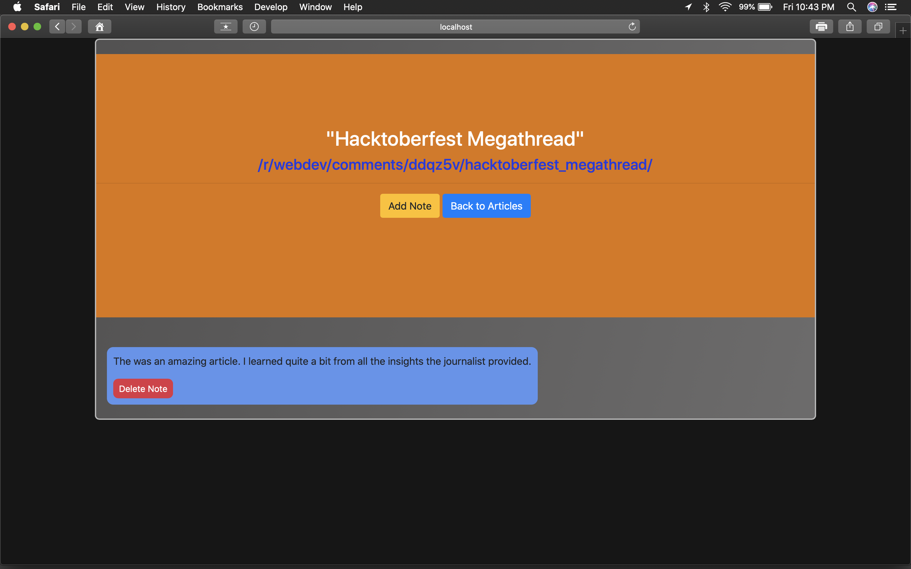
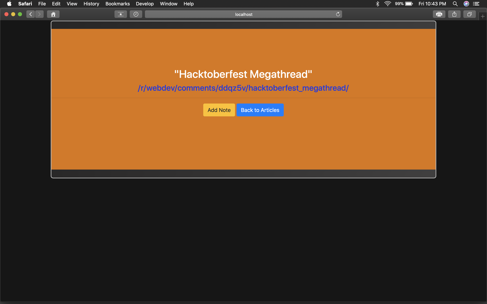

# mongo-scraper

## Mongo-scraper is a web application that uses Mongoose and Cherrio to scrape news from reddit.

## Technologies used:

### 1. Express 
### 2. Mongoose
### 3. Cheerio
### 4. Handlebars
### 5. Node Js
### 6. Bootstrap
### 7. Jquery
### 8. JavaScript
### 9. CSS 
### 10. HTML

## How the app works:

### When the home page loads the user is presented with a jumbotron and a brief intro to what the application does. If the user is interested in reading articles from reddit they will hit the "Scrape Articles" button. From there the application logic will scrape reddit and return articles with headlines and their appropriate links. The user has the opportunity to leave notes on each individual article, or delete the created notes if they wish. 

## You can visit site at https://fast-everglades-38446.herokuapp.com/
